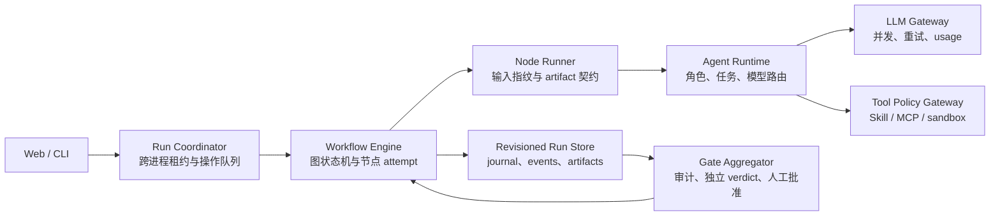

# Research Agent 剩余问题与改进计划

> 复核日期：2026-09-02
>
> 复核基线：`master@068869c`（8 个提交）
>
> 本文性质：后续实施计划，不修改当前业务行为

## 0. 实施进度（随实施更新）

| 阶段 | 状态 | 提交 | 备注 |
| --- | --- | --- | --- |
| 阶段 A（SEC-01 / GATE-01 / DOC-01 / WEB-02） | ✅ 完成 | bc33c43、185766f、7677414 | SEC-01 与 GATE-01 各自独立提交并带行为级回归测试；README/examples 已作为 TOML fixture 进入测试 |
| 阶段 B（LOCK-01 / TX-01 / ART-02 / ART-03） | ✅ 完成 | f826d08 | 跨进程 flock 租约 + 回退 journal + 幂等恢复 + reason/actor 持久化 + 磁盘余量检查；per-run/global 归档配额与 CLI 归档清理命令仍属后续（ART-03 的完整版） |
| 阶段 C（REV-01 / TRACE-01 / SKILL-02 / ART-01） | ✅ 完成 | 9ddd4be、63afaec、0daa30a、79de87d | Manifest schema v2（revision/branch_id/node_id/attempt_id/event_id，v1 读兼容）；完整性审计按 active branch 过滤；call_id 贯穿 prepare→call→validate；effective skill 内容哈希进 checkpoint 与账本；节点归属 registry + 未归属文件报告 |
| 阶段 D（ENGINE-01 / STATE-01） | ⚠️ 部分完成 | 106c92a | run-node-events.json 追加式事件日志 + 归约器（9 种节点状态、每 revision attempt 列表）；pipeline/rollback/web 失败路径全部接入发射适配器；WorkflowEngine 将 19 条声明边全部实现为可测试谓词（表驱动测试证明无死边）；完整性审计新增 node_state_consistency；API 暴露 node_states。**STATE-01 已闭合，ENGINE-01 未闭合**：`workflow_state.WorkflowEngine` 在 `src/` 内被引用 0 次（仅 `tests/test_workflow_state.py` 导入），调度真相仍是 `_run_after_review_approval` 的顺序控制流 +「产物存在即复用」；逐节点搬迁尚未开始，§5 ENGINE-01 的验收标准未满足 |
| 阶段 E（AGENT-01 / GATE-02 / ROUTE-01 / COST-01） | ✅ 完成 | 2665e56 | agent_verdict.py 独立执行层（每角色最小证据视图、串行、verdict 绑定 call_id/model/revision/哈希，invalid 按 block）；statistician 获得独立 T10 统计审查任务；GateAggregator 聚合确定性审计 + 独立 verdict + 缺失角色 + 人工 override（需 reviewer/reason/revision/verdict 哈希），blocked 强制 final readiness 为 blocked；ROUTE-01 路由枚举 + preflight llm_routes；COST-01 provider usage 进账本与 economics 汇总，model_costs 价格表按模型计价（provider_cost_usd）。遗留：合入后尚无任何真实 run 产出 `10-gate-decision.json` / `10-independent-deliberation.json`，见 §0.2 |
| 阶段 F（MCP-01 / MCP-02 / SANDBOX-01） | ✅ 完成 | dee4d00 | tools/list 能力核验（工具存在 + readOnlyHint=False 拒绝）；意图级回执（requested/denied/started/success/failed/outcome_unknown，含 tool_call_id、参数 shape、脱敏错误）；超时记 outcome_unknown 不自动重试；README 改称受限本地执行 |
| 阶段 G（WEB-01 / LIVE-01 / WEB-03 / DEPLOY-01） | ✅ 完成 | 0f9d05b | /api/agent-catalog + 前端智能体配置视图（角色开关/模型/skill/MCP，Key 永不进页面）；状态签名纳入 workflow revision/updated_at；/api/runs 与详情支持 ETag 304；/api/runs/{id}/activity SSE 事件流（cursor 增量）；docs/platform.md 记录 TLS 拓扑与 SSE 协议 |
| 阶段 H（TEST-01 / 收尾） | ⚠️ 部分完成 | 5400f41、CI-01 | scripts/run_tests.sh 隔离测试入口（PYTEST_DISABLE_PLUGIN_AUTOLOAD=1）；scripts/check_docs.py Markdown 链接检查；rollback-prune 归档清理 CLI（ART-03 完整版）；备份/恢复/保留策略文档。**TEST-01 的 CI 部分当时未交付**（无 `.github/`、无 Makefile/tox/nox），已由 CI-01 补齐，见 §0.1 |

### 0.1 阶段 A-H 之后的接线修复（2026-09-04）

阶段 A-H 标记完成后重新做了一轮对抗式复核，共发现八项缺陷。前四项（READY-01 / PKG-01 / CFG-01 / CI-01）共享同一个模式：新层的产物写出来了，但下游消费者没有跟着改，而既有测试用伪造的 fixture 掩盖了这一点。DOC-02 / DOC-03 是文档与代码脱节。BUDGET-01 与 UA-01 性质不同——两者都不是读代码读出来的，而是真实故障后从 `run-diagnostics.json` 与线上响应倒查出来的：前者是校验器把数学上不可能成功的配置判为健康，后者是报错信息（超时）指向了与真因（客户端签名被封）完全不同的方向。静态复核会系统性漏掉这两类问题。

| ID | 问题与证据 | 修复 | 提交 |
| --- | --- | --- | --- |
| READY-01 | `perfect_agent_readiness.py:1022` 只读 `10-agent-deliberation.json`。该文件由确定性投影写出：`multi_agent_deliberation.py:96` 把 `independent_agent_execution` 硬编码为 `false`，`:87` 决定 `status` 只会是 `review_required` 或 `block`。阶段 E 的独立层写的是另一个文件（`agent_verdict.py:23`）。`agent_deliberation_consensus` 因此是**永久假阴性**——两个方向都不可能满足。 | 改以独立层为主证据：需 `status=pass`、至少 4 条带正 ledger call id 的独立 verdict、且 `10-gate-decision.json` 为 `publishable`。确定性投影仅作上下文展示，永远不能单独满足该能力（§11 的诚实标注规则）。文件名改为从归属模块导入常量而非字面量，使漂移在导入层就暴露。gold run fixture 原先在投影文件里伪造 `independent_agent_execution=True`，改为写流水线真实产出的三个产物。 | 7ac7dc9 |
| PKG-01 | `submission_package.py` 是显式白名单、无 glob，缺 `10-gate-decision.*` 与 `10-independent-deliberation.*`。投稿包携带了备注为"不代表独立 Agent verdict"的确定性投影，却没有真正决定能否 publishable 的裁决。 | 三层按序入包（投影 → 独立 verdict → 最终裁决）。gate decision 设为 `required`：`_finalize_gate_decision` 在 `_run_after_review_approval` 的两次打包（`:2718` 与 `:3011` 的 `submission_package_refresh`）之前都会执行；独立 deliberation 保持 optional，因为仅 `multi_agent` 启用时存在。 | 3980847 |
| CFG-01 | `examples/paper-grade-config.toml:5` 有字面 `api_key = "replace-for-real-run"`，与 SEC-01 立场矛盾；`docs/phases/01-literature.md:40` 称该示例"可直接预检"，但命令在修改前后都以退出码 2 结束。 | 示例不再声明任何凭据。写 `api_key_env` 并非更安全而是更误导：`resolve_llm_api_key`（`llm.py:535`）只在 effective endpoint 与可信来源同源时释放 env key，而该文件 `base_url` 指向 discard 端口，key 永远解析不出来。文档改为如实列出两项无条件 fail 与一项环境相关 fail；新增测试扫描全部 example TOML 的未注释 `api_key` 赋值与解析结果。 | 0cc2077 |
| CI-01 | TEST-01 只交付了 `scripts/run_tests.sh`，未交付其明确要求的"在 CI 使用全新环境"；仓库无 `.github/`、无 Makefile/tox/nox。"某个提交上测试通过过"因此只有文档里一行手写记录。 | 三个 job：3.11/3.12 矩阵（仅 dev extra，`RESEARCH_AGENT_PYTHON_BIN` 固定解释器）、mcp extra 全量（让 streamable-http 路径跑在真实 SDK 而非只有 ImportError 回退）、以及"143 个模块纯标准库导入"的零依赖断言（design-notes §5 把该性质作为可信度论据，需被 CI 锁住）。 | 639c311 |
| DOC-02 | `README.md:80` 与 `design-notes.md:15` 称"9 个 LLM 任务（T01-T09）"，实际 `agent_runtime.py:52-61` 为 10 个（T10 = statistician 独立统计审查，AGENT-01 引入）；`design-notes.md:16` 称"LLM 侧只有角色化提示 + 模型路由"，已不符两层结构；§0 表把阶段 D 记为 ✅ 完成。 | 任务数改为 T01-T10；design-notes 补两层审计与 `gate_aggregator` 汇总裁决；阶段 D 降级为 ⚠️ 部分完成并注明 ENGINE-01 未闭合；阶段 H 降级为 ⚠️ 部分完成（CI 由 CI-01 补齐）；README 阶段 10 产物清单补入三个新产物，并新增"角色审计分两层"与最终门禁的说明段落。 | 5f709e0 |
| DOC-03 | `README.md:60` 让读者运行 `python -m research_agent_web`，该模块不存在（pyproject 声明的是 console script `research-agent-web`，模块是 `research_agent.web_server`），照文档第一次部署就 ModuleNotFoundError。`.gitignore` 只有 `env/`，匹配的是名为 env 的**目录**，因此仓库根目录的 `.env` 凭据文件是可提交的。 | README 给出两种可用入口并说明回环默认与非回环 token 要求；`.gitignore` 补 `.env` / `.env.*` / `*.env` 并保留 `!.env.example`；`git check-ignore` 实测确认生效。 | 8f5d58b |
| BUDGET-01 | 由真实故障发现，不是读代码发现：`runs/注意力机制-20260904-063644` 在第一个阶段就死于 `LLM budget exceeded: max_prompt_chars=1, next_prompt_chars=5340`，账本 3 条全为 `budget_exceeded`、`response_chars=0`、耗时约 9ms——从未出网。而它自己的 `00-preflight.json` 里 `llm_max_prompt_chars` 是 `pass`「LLM prompt 字符上限已配置」，因为 `preflight.py:243-259` 只区分负数（fail）、0（pass 不限制）和任意正数（pass）。同一次报告里 4 条 `memory_*` 检查确实警告了预算偏低，但紧挨着一条说 pass 的直接检查，警告读不出来。 | 采用一条原则性不对称：**无法容纳任何一次调用 → fail；能调用但不足以完成端到端 run → warn**。正数 prompt 上限低于 8192 判 fail（首个也是最小的研究计划阶段实测约 5.3k 字符），低于推荐值 20000 判 warn。`max_calls` 的下限改为**推导**而非硬编码：`len(REQUIRED_STAGE_SPECS)`，启用 multi_agent 时再加 `len(ROLE_EVIDENCE_VIEWS)`，即单智能体 7、多智能体 13——下限随规格自动跟进（避免 READY-01/PKG-01 那类漂移），也不会误判合法的单智能体预算。对同一份 `run-config.json` 实测：旧代码 `pass/pass`（overall warn，放行），新代码 `warn/fail` 并在 action 里指名预算拦截点。 | ff3fbe7 |
| UA-01 | 同样由真实故障发现：三条 LLM 出站路径（chat completion `llm.py:101`、model discovery `llm.py:682`、preflight ping `preflight.py:2121`）都不设 User-Agent，urllib 因此发 `Python-urllib/3.12`。Cloudflare 前置的 OpenAI 兼容网关按客户端签名直接回 **HTTP 403 error code 1010**，请求根本到不了源站。由于每个候选 URL 和每次重试都被同样拦掉，deadline 耗尽，用户看到的是「LLM model discovery exceeded its total timeout budget」——**一个指向错误方向的超时**，而不是鉴权错误。ping 受影响最严重：它是 UI「Ping」按钮和 `gold-run-doctor --ping-llm` 的连通性诊断，凭据有效时也会报连通失败。 | 三条路径统一发送 `llm.USER_AGENT`，复用 `literature_sources` 已在用的标识（另三个出站模块各自设了 UA，只有 llm.py 漏）。实测双向对照：`curl -A Python-urllib/3.12` → 403/1010，`curl` 默认 UA → 401 `API_KEY_REQUIRED`；Python 不设 UA → 403/1010，设任意非 urllib UA → 401 `API_KEY_REQUIRED`。经真实端点对真实网关：修复前 403/1010 耗时 7.08s，修复后 401 `API_KEY_REQUIRED` 耗时 1.27s。三个测试从 request 对象上抓取 header，修复前记录为 `None`。 | 8e224da |

### 0.2 2026-09-04 的历史缺口及后续状态

2026-09-09 更新：新建与检查点恢复已接入实际 `WorkflowEngine.run`，人工覆盖语义校验及线程互斥已修复，见 [修复说明](workflow-integrity-fixes.md)。以下“未闭合”描述保留为此前审计记录；线上 multi-agent canary 和真实用户效果测量仍未闭合。

#### 原审计记录

- **ENGINE-01 未闭合。** `workflow_state.WorkflowEngine` 在 `src/` 内被引用 **0 次**，仅 `tests/test_workflow_state.py` 导入它。追加式事件日志、状态归约器和 19 条边谓词都已实现并有表驱动测试，但调度真相仍是 `_run_after_review_approval` 的顺序控制流加「产物存在即复用」。§5 ENGINE-01 的验收标准（"把节点定义升级为可执行 registry，由 scheduler 根据状态和条件选边；产物复用成为节点 checkpoint 策略，而不是隐式控制流"）未满足。§12 主张把逐节点搬迁延后到 revision-aware Manifest 与产物契约稳定之后，该判断仍然成立；不成立的是把阶段 D 记为完成。当前状态是**两个执行模型并存，只有一个是真的**。
- **阶段 E-H 零 live-run 证据。** 截至 2026-09-04，`runs/` 下 96 个 run 中没有任何一个产出 `10-gate-decision.json` 或 `10-independent-deliberation.json`（实测 `find` 计数均为 0）。阶段 E-H 的提交在 2026-09-03；此后唯一一次尝试是 `runs/注意力机制-20260904-063644`，它在 `stage=started` 就死于 BUDGET-01 的预算拦截，从未到达门禁阶段。阶段 H 验收中的"生成一次真实但低成本的端到端 canary Run，人工核对 revision、角色调用、MCP receipt、审批、成本和最终 gate"尚未执行。因此 READY-01 修好的只是评分器的读取路径：`agent_deliberation_consensus` 要真正变为 ready，仍需一次真实的 multi-agent run。
- 结论：M2（可信工作流版）的代码与契约测试已到位，但没有端到端运行证据，仍不可对外声明。

验证：UA-01 合入后在 Python 3.12 + dev extra 下经 `scripts/run_tests.sh` 跑完全量，**1352 passed, 1 skipped, 72 subtests**。Python 3.11 + dev 与 Python 3.12 + dev,mcp 两种配置最近一次实测是在 BUDGET-01 之前，均为 1345 passed（READY-01 至 DOC-03 合入后）；BUDGET-01 与 UA-01 只改 `preflight.py`、`llm.py` 与对应测试，但本文件不用推断代替实测——这两种配置由 `.github/workflows/ci.yml` 的矩阵在每次 push 上覆盖，此后不再依赖手写数字。阶段 A/B 生效后即可解除 §4 的临时运行约束中与凭据和回退审批相关的两项；`local`/`benchmark` 回退后自动执行现在会正确停在执行审批门（批准文件已随回退归档失效）。

## 1. 结论

当前版本已经从“线性脚本原型”推进到具备配置快照、人工门禁、LLM/MCP 账本、工作流可视化和阶段回退的可审计研究自动化原型。现有 1243 个测试全部通过，说明既有契约的回归保护较完整。

但当前版本还不应被定义为“可安全共享部署的、真正非线性的多智能体工作流系统”。剩余差距不是页面细节，而是三个底层契约尚未闭合：

1. 凭据必须与 endpoint 来源绑定，审批必须与 workflow revision 绑定。
2. 回退必须成为跨进程互斥、崩溃可恢复、审计按 revision 隔离的事务。
3. 工作流图必须成为执行状态机；多智能体 verdict 必须来自独立执行，并真正影响最终门禁。

在 P0 问题修复前，不建议给角色配置与全局 LLM 不同的 endpoint，也不建议对 `local`/`benchmark` Run 使用“回退到 experiments 后自动续跑”。在 P1 完成前，Web 仅适合单机、单服务进程、可信用户使用。

## 2. 复核范围与验证基线

本次复核覆盖以下区域：

- LLM 凭据解析、角色模型路由、调用账本与成本审计。
- Skill 加载、MCP 配置、调用协议和工具回执。
- Checkpoint 指纹、repair-resume、workflow rollback、人工审批绑定。
- Workflow 状态、Agent 活动流、Web 配置合并和轮询刷新。
- 最终 readiness、多智能体 deliberation、Manifest 与完整性审计。
- README、示例配置、平台文档和当前测试契约。

验证结果：

```text
PYTEST_DISABLE_PLUGIN_AUTOLOAD=1 .venv/bin/python -m pytest -q
1243 passed, 1 skipped, 72 subtests passed in 186.72s
```

直接运行 `.venv/bin/python -m pytest -q` 会被宿主机 ROS 自动加载的 pytest 插件及其缺失的 `yaml` 依赖阻断，尚未进入项目测试。这不是业务测试失败，但说明本地测试入口还不够隔离，已列入 P2。

本次还做了三个最小复现：

- 角色切换到不同 endpoint 时，字面量全局 API Key 仍进入该角色 client。
- README 中的多智能体 TOML 交给 `load_config()` 后报 `multi_agent.roles must be a list`。
- 回退到 `experiments` 时，preview 声明需要重新执行审批，但归档列表不包含 `03-execution-approval.json`。

## 3. 风险分级

- **P0：立即止血。** 可能泄露凭据或绕过人工执行授权；修复前限制相关功能。
- **P1：下一版本发布阻断。** 会破坏回退一致性、审计可信度或用户明确要求的核心能力。
- **P2：工程化改进。** 不一定立即产生错误，但会限制长期可靠性、可观测性或部署范围。

## 4. P0 问题

| ID | 问题与证据 | 影响 | 首选修复 |
| --- | --- | --- | --- |
| SEC-01 | `src/research_agent/agent_runtime.py:248` 基于全局 `LLMConfig` 做 `replace()`，角色 endpoint 改变时没有清空 `llm.api_key`；`src/research_agent/llm.py:504` 对字面 Key 无条件返回。 | 全局服务密钥可能被发往角色指定的其他域名，破坏凭据来源绑定。 | 引入显式 `CredentialBinding(origin, env_name)`。只要 effective endpoint 与全局 endpoint 不同，就强制清空全局字面 Key，并要求该角色同时声明匹配的 `base_url_env` 与 `api_key_env`。无法证明同源时在预检阶段阻断。 |
| GATE-01 | `src/research_agent/workflow_graph.py:308` 对 `experiments` 设置 `execution_reapproval_required=true`，但 `_NODE_PATTERNS["experiments"]` 在 `src/research_agent/workflow_graph.py:150` 只归档 `04-*`；`src/research_agent/pipeline.py:3303` 会在 plan/safety/binding 未变化时沿用旧批准。 | 用户回退实验后，系统可能跳过界面承诺的重新审批并再次执行本地或 Benchmark 命令。 | 回退 plan 由“阶段依赖闭包”生成，并强制包含需要失效的 approval。应用前增加 invariant：任何 `*_reapproval_required=true` 对应的批准文件必须出现在归档计划中，否则拒绝回退。审批再绑定 `revision`、Manifest/源码/命令输入哈希。 |

### P0 临时运行约束

在代码修复合入前：

- 所有角色只使用全局 endpoint；不要为角色设置 `base_url` 或 `base_url_env`。
- `local`/`benchmark` Run 不从 `experiments` 或更早节点回退后自动执行；改为创建新 Run，或人工删除旧执行批准并核验归档。
- Web 不对不可信用户开放，不把全局字面 API Key 放入持久配置。

## 5. P1 问题

| ID | 问题与证据 | 影响 | 改进方向 |
| --- | --- | --- | --- |
| DOC-01 | README `README.md:89` 和示例 `examples/config.toml:83` 使用 `[multi_agent.roles.<id>]`；解析器 `src/research_agent/config.py:210` 要求 `roles`/`mcp_servers` 是 list，测试实际使用 `[[multi_agent.roles]]`。README 的 DeepSeek 示例还只有字面 `base_url` + `api_key_env`，不满足 `src/research_agent/llm.py:522` 的同源环境变量校验。 | 用户照文档配置时启动失败；即使改成数组，角色 Key 仍可能解析为空。 | 文档统一改为 array-of-tables，并给出成对的 `base_url_env`/`api_key_env`。把 README 示例作为真实 fixture 加入测试，防止文档再次漂移。 |
| LOCK-01 | Web 互斥锁只存在于单个 `RunStore` 进程内，见 `src/research_agent/web_server.py:648`、`:741`；CLI `resume`、`repair-resume`、`rollback` 在 `src/research_agent/cli.py:1165` 起直接写同一 Run。 | 两个 Web 进程，或 CLI 与 Web，可同时恢复、审批、回退和写 Manifest，产生重复 LLM 调用及产物竞争。 | 为每个 Run 增加 OS 文件锁/租约，所有 CLI、Web 和 worker 入口共用；锁记录 owner、PID、operation、heartbeat、revision。只有持锁者能写 Run。 |
| TX-01 | `src/research_agent/workflow_graph.py:395` 逐个移动文件，之后才更新 rollback index、checkpoint、state 和 Manifest。异常可在进程内恢复，但 `SIGKILL`/断电不会执行 `except`。 | 可留下半归档 Run、`applying` preview 和相互矛盾的状态文件。 | 增加 rollback journal（`prepared -> moving -> metadata_committed -> completed`）、逐项 move log 和启动恢复器；元数据用原子替换并 `fsync`。故障恢复必须幂等。 |
| REV-01 | LLM entry 和 MCP receipt 有 revision，但 Manifest 的 `RunEvent` 在 `src/research_agent/provenance.py:17` 没有 revision/branch；`src/research_agent/run_integrity_audit.py:458` 等审计直接扫描累计 events。 | 回退后的当前分支可能继续由旧 revision 的成功调用、审批和事件背书，审计结论不可信。 | Manifest schema v2 为 event/artifact 增加 `revision`、`branch_id`、`node_id`、输入/输出哈希；默认审计仅评价 active revision/branch，历史只作为 provenance 展示。 |
| AGENT-01 | `src/research_agent/multi_agent_deliberation.py:64` 对同一份审计数据执行确定性函数，并在 `:96` 明确写 `independent_agent_execution=false`。T01-T09 中没有 statistician 的实际 LLM 任务，见 `src/research_agent/agent_runtime.py:48`。 | “8 个角色独立判断”尚未实现；角色数与真实调用数不一致。 | 保留确定性 projection 作为第一层安全审计，另建独立 Agent 执行层。每个角色获得最小、不同的证据视图，输出强类型 verdict，并分别记录 route、模型、prompt/response hash 和 revision。为 statistician 增加独立统计审查任务。 |
| GATE-02 | Deliberation 在 `src/research_agent/pipeline.py:2518` 生成，但 `build_final_readiness_report()` 在 `:2533` 没有接收它；函数签名 `src/research_agent/final_readiness.py:7` 也无该字段。 | 即使 deliberation 为 `block`，仍不会阻止 readiness 或交付包。 | 建立单一 `GateDecision` 聚合器。确定性审计 block、有效独立 verdict block、未解决冲突、无效/缺失必需角色任一成立时，禁止 publishable/completed，仅进入 repair 或人工 override。 |
| MCP-01 | `src/research_agent/tool_runtime.py:110` 只验证本地配置中的 `read_only=true`；实际调用在 `:266` 直接 `call_tool`，没有 `tools/list` 能力核验。服务端副作用不可由客户端布尔值保证。 | “强制只读”表述超出真实安全保证；超时后的远程副作用状态可能未知。 | 改名为“声明只读 + 客户端 allowlist”。连接时执行 `tools/list`，核对工具存在、schema 和 annotations；高风险/未知工具必须 gate。timeout 记为 `outcome_unknown`，禁止盲目自动重试。 |
| MCP-02 | 只有进入 `ToolRuntime.call()` 后的成功/异常会写 receipt；解析失败、角色未授权、server/tool 白名单拒绝在 `src/research_agent/agent_runtime.py:225` 与 `src/research_agent/tool_runtime.py:168` 提前抛出。 | 安全拒绝和无效工具意图缺少完整审计轨迹。 | 所有 tool intent 都分配 `tool_call_id` 并落账：`requested/denied/started/success/failed/outcome_unknown`。参数只存 hash/shape，错误脱敏。 |
| WEB-01 | 后端支持 `multi_agent` payload，但 `web/index.html` 与 `web/app.js` 没有角色、任务模型、Skill 或 MCP 配置控件。 | 用户无法从主要界面使用已实现能力，只能手写 TOML/API payload。 | 增加 Agent 配置视图：角色开关、模型选择、endpoint env 绑定、Skill 多选、MCP server/tool 白名单、逐 route 健康检查。前端永不读取或回显密钥值。 |
| WEB-02 | flat role override 在 `src/research_agent/web_server.py:7644` 重建 `AgentRoleConfig` 时没有保留既有 `base_url`、`base_url_env`、`api_key_env`。 | Web 修改模型/Skill 时可能静默丢失角色 endpoint/凭据来源。 | 使用 `replace(role, ...)` 或完整字段合并；加 round-trip 与 partial-patch 测试。 |
| LIVE-01 | `web/app.js:1681` 的状态签名不包含 `workflow.updated_at`。同一 pipeline stage 内，摘要被合并时又保留旧完整 workflow，见 `:1707`。 | Agent、模型、任务或 MCP 活动在阶段不变时不能稳定实时刷新。 | 短期把 workflow revision/updated_at/event cursor 纳入签名；中期使用 SSE 或带 cursor 的增量事件接口，并保留轮询降级。 |
| ENGINE-01 | `src/research_agent/workflow_graph.py:37` 声明图和分支，但节点状态按线性索引推导，见 `:491`；真实执行仍由 `pipeline.py` 的大型顺序函数和“文件存在即复用”控制。 | 图是展示模型而非执行真相；分支、失败、跳过和回退状态可能被错误表示。 | 把节点定义升级为可执行 registry，由 scheduler 根据状态和条件选边；产物复用成为节点 checkpoint 策略，而不是隐式控制流。 |

## 6. P2 与后续改进

| ID | 当前缺口 | 建议 |
| --- | --- | --- |
| SKILL-01 | 隐式角色拿不到文档宣称的默认 Skill：`src/research_agent/agent_runtime.py:152` 只有角色显式存在时才返回 skills。 | multi-agent 开启时为所有内置角色创建 effective role；区分“未配置，使用默认值”和“显式 `skills=[]` 禁用默认值”。 |
| SKILL-02 | Checkpoint 只哈希显式 `role.skills`，见 `src/research_agent/pipeline.py:4242`；默认 Skill 内容变化不会进入输入指纹。 | 将 effective Skill id、内容 SHA256、版本和来源写入 checkpoint、每次调用账本及 submission provenance。 |
| ROUTE-01 | Preflight 主要检查全局 LLM，未解析并 ping 全部有效 task/role route。 | 启动前枚举唯一 `(provider, endpoint, model, credential source)`，做无密钥回显的静态检查和可选并发受限 ping。 |
| COST-01 | 成本按全局单价和字符估算，`src/research_agent/run_economics_audit.py:193` 未按 route/model 计价；HTTP usage 未进入 ledger。 | 优先记录 provider 返回的 usage；按 route/model 价格表计算，字符估算明确标记 estimated。 |
| TRACE-01 | Validation 通过“同 stage 最后一个 pending”关联，见 `src/research_agent/llm_trace.py:161`。 | `prepare -> call -> validate` 全程传递不可复用的 `call_id`；匹配时同时校验 agent、route、revision。 |
| ART-01 | 回退归档范围依赖 `01-*`、`10-*` 等宽泛 glob，见 `src/research_agent/workflow_graph.py:135`。 | 节点声明精确 artifact ownership 和依赖；由反向依赖闭包计算失效范围。未知文件只提示，不自动归属。 |
| ART-02 | Web 在 `apply_rollback()` 返回后才把 reason 放入内存对象，见 `src/research_agent/web_server.py:1001`；archive 内的 `rollback.json` 没有 reason，CLI 也未传入。 | reason 作为 apply 参数，在写 archive report、Manifest 和 index 前统一持久化并限制长度。 |
| ART-03 | Archive 没有累计配额、磁盘余量检查和清理策略；preview 记录没有统一回收。 | 应用前检查 free space；配置 per-run/global quota；只允许显式、可预览、可审计的清理。过期 preview 安全回收。 |
| SANDBOX-01 | 本地实验只有命令策略、cwd、最小环境和超时，`src/research_agent/experiments.py:372` 仍是宿主机子进程。 | UI/文档改称“受限本地执行”。正式不可信代码使用容器、bubblewrap 或独立 worker，限制网络、文件系统、CPU、内存和进程数。 |
| DEPLOY-01 | 非回环部署用 HTTP Basic，但应用自身不提供 TLS。 | 明确只允许置于 TLS reverse proxy 后；支持可信代理配置和安全 cookie/session，或继续限定回环 + SSH tunnel。 |
| STATE-01 | 节点只有 `pending/running/waiting/completed` 的线性推导，无法准确表达 `skipped/failed/cancelled/rolled_back/stale`。 | 状态由事件归约得到；每个 revision 保留节点 attempt 列表，UI 显示当前 attempt 与历史分支。 |
| TEST-01 | pytest 会受到宿主 ROS 插件自动加载影响。 | 提供 `make test`/脚本或 tox/nox 的隔离入口，固定 test extras，并在 CI 使用全新环境。 |
| WEB-03 | HTTP 轮询仍需不断拉 runs 摘要，活动事件没有 cursor/ETag。 | 为列表和详情增加 ETag；活动流使用 SSE + `Last-Event-ID`，后台 tab 降频，断线指数退避。 |

## 7. 目标架构

建议保留“纯 Python、文件产物可读”的项目特色，不急于直接引入 LangGraph/CrewAI/AutoGen 运行时。先把这些项目的关键契约落实到现有架构中：持久状态机、独立 Agent 执行、可追溯 handoff 和 time-travel revision。



关键规则：

- `Run Coordinator` 是唯一写入口；Web、CLI、worker 不再各自直接改文件。
- 每次节点执行生成不可变 `attempt_id`，输入包含 `revision + config hash + dependency hashes`。
- Artifact、LLM call、MCP call、approval 和 Manifest event 都绑定同一 `branch_id/revision/attempt_id`。
- 回退创建新 revision，不删除历史；只有 active branch 的有效证据能参与当前 gate。
- 确定性审计与 LLM Agent verdict 分层保存，不能互相冒充。

## 8. 分阶段实施计划

工期为相对量级，默认一名熟悉代码库的工程师；每个阶段单独提交、全量测试通过后再进入下一阶段。

### 阶段 A：安全止血与文档契约（1-2 天）

范围：`SEC-01`、`GATE-01`、`DOC-01`、`WEB-02`。

交付：

- 实现 endpoint/credential origin 的单一解析函数，Web、CLI、preflight、runtime 全部复用。
- 回退预览和应用共同验证 approval invalidation invariant。
- 修正 README 与 `examples/config.toml`，加入可直接解析的角色、task model、Skill、MCP 示例。
- Web partial override 保留未修改的角色字段。

验收：

- 捕获 HTTP 请求的测试证明：不同 origin 永远收不到全局 Key；相同 origin 的现有配置仍兼容。
- `experiments` 回退后 `03-execution-approval.json` 已归档，resume 停在 `awaiting_execution_approval`。
- README 中代码块直接作为 TOML fixture 通过解析与 preflight。
- P0 两项加入固定回归测试，不能只测试 helper。

### 阶段 B：统一 Run 锁与崩溃安全回退（3-5 天）

范围：`LOCK-01`、`TX-01`、`ART-02`、`ART-03`。

交付：

- `RunLease`/`RunOperation` API 覆盖 create/resume/approve/repair/rollback/cancel 及 worker 写路径。
- rollback journal、原子元数据提交、启动时 reconcile 和幂等恢复。
- reason、actor、operation id、归档配额和磁盘检查进入 rollback report。

验收：

- 两个独立进程同时 resume/rollback，只有一个成功持锁，另一个得到可诊断冲突。
- 在每个 move/metadata 步骤注入进程终止；重启后只允许完整恢复到旧 revision 或完整提交到新 revision，不出现中间态。
- 连续执行同一 recovery 不会重复移动、重复递增 revision 或重复写审批事件。

### 阶段 C：Revision-aware Manifest 与产物依赖（5-8 天）

范围：`REV-01`、`ART-01`、`SKILL-02`、`TRACE-01`。

交付：

- Manifest/ledger/receipt/approval schema v2；所有记录有 `branch_id/revision/node_id/attempt_id`。
- 节点 registry 显式声明 inputs、outputs、gate、失效依赖和 checkpoint policy。
- 审计查询 API 默认使用 active revision；可显式选择历史 revision 作对比。
- effective Skill 内容哈希和 route binding 成为节点输入。

验收：

- 构造 revision 0 成功、revision 1 失败的 Run，当前 readiness 必须失败，不能借用 revision 0 的成功事件。
- 回退任一节点时，失效闭包与 registry 契约一致；批准、LLM、MCP 和 artifact 均可追到同一 attempt。
- 修改默认 Skill 内容后，受影响节点不可复用旧 checkpoint。

### 阶段 D：执行图状态机（7-12 天）

范围：`ENGINE-01`、`STATE-01`。

交付：

- `WorkflowEngine` 负责选边、调度 node、等待 gate、失败重试、repair 和 rollback 后续跑。
- 状态由追加事件归约，节点支持 `pending/running/waiting/completed/skipped/failed/cancelled/rolled_back/stale`。
- 首轮先用 adapter 包装现有阶段函数，保持所有产物名与 Manifest 契约不变。

验收：

- 表驱动测试覆盖 `review revision`、`execution approval`、`writing_blocked`、`paper recheck`、repair、cancel 和 rollback 分支。
- 每条声明 edge 至少有一个测试；不存在声明可达但执行不可达的边。
- 任意节点重启恢复不依赖“碰巧存在某个文件”，而是校验完整 checkpoint contract。

注意：此阶段不建议直接拆分 1558 行的 `_run_after_review_approval`。先把它包在节点/事件契约外层并建立 revision-aware 测试锚点；待输入输出边界稳定后，再逐节点搬迁，避免改变现有 Manifest 语义。

### 阶段 E：真实多智能体与最终门禁（5-8 天）

范围：`AGENT-01`、`GATE-02`、`ROUTE-01`、`COST-01`。

交付：

- 定义 `AgentVerdict` schema：角色、职责、证据引用、结论、置信度、反证、required actions、route/revision/attempt。
- evidence、method、benchmark、statistics、review、editing 等角色各自执行独立任务；默认串行或按 endpoint 限流，避免放大共享网关的 429（该网关按用户限并发）。
- 独立上下文最小化：每个角色只读完成职责所需的产物，禁止把其他角色 verdict 当作自己的原始判断。
- `GateAggregator` 把规则审计、独立 verdict、冲突解析和人工 override 汇总为唯一最终决策。
- 记录 provider usage，并支持按 route/model 的价格表。

验收：

- 启用独立 deliberation 时，账本中存在按要求角色区分的真实调用，尤其包含 statistician；每条 verdict 有独立 call id 和 evidence hash。
- 任一必需角色返回 block、无效 schema、缺失证据或调用失败时，不得标记独立共识通过。
- `GateAggregator=block` 时不能生成 publishable handoff；人工 override 必须有 reviewer、reason、revision 和被覆盖 verdict 哈希。
- 同一 gateway 的最大并发可配置为 1；429 服从 `Retry-After`、全局预算与 deadline，且不会出现重试风暴。

### 阶段 F：工具治理与执行隔离（3-6 天）

范围：`MCP-01`、`MCP-02`、`SANDBOX-01`。

交付：

- MCP session 初始化后缓存 `tools/list` 结果，校验名称、input schema 和 annotations；服务端变化使 route health 失效。
- 所有工具意图和结果进入状态机；超时使用 `outcome_unknown`，需要人工确认后才可重试有潜在副作用的调用。
- 文档准确区分“客户端 allowlist”“服务端声明只读”和“可强制隔离”。
- 不可信实验放入受资源限制的独立执行环境；在此之前 UI 不再称其为 sandbox。

验收：

- 不存在、schema 不匹配、未授权、解析失败、超时和成功调用都有脱敏 receipt。
- 远程 server、重定向、DNS/地址变化和 auth 错误有安全测试。
- 隔离测试证明实验不能读取项目外秘密、不能访问未授权网络、不能逃逸资源限制。

`stdio` MCP 和写工具继续暂缓，直到执行隔离及独立工具审批 gate 完成。

### 阶段 G：Web 配置与实时可观测性（3-5 天）

范围：`WEB-01`、`LIVE-01`、`WEB-03`、`DEPLOY-01`。

交付：

- Agent 配置页与后端 runtime catalog 对齐，不在前端硬编码角色/任务集合。
- route test 展示 endpoint origin、模型、credential env 是否存在、Skill hash、MCP capability；不返回 secret。
- SSE activity endpoint 提供 event id、revision、attempt、stage、agent、model、tool 和状态；保留低频摘要轮询。
- revision/branch/attempt 可视化，准确显示失败、跳过、回退和等待人工。
- 非回环部署文档要求 TLS reverse proxy，并给出受支持拓扑。

验收：

- 仅通过 Web 可完成角色模型、task override、Skill 与 MCP 的配置、预检、启动、刷新和恢复。
- 修改任一控件后保存再加载，配置逐字段一致；Key 值不出现在 DOM、响应、日志或 run-config。
- 同一 stage 内连续 Agent/MCP 事件在一个推送周期内出现；断线重连不丢失也不重复展示事件。
- 桌面与移动端完成 Playwright 流程验收，并覆盖慢响应、切换 Run、回退和错误状态。

### 阶段 H：发布工程化（2-4 天）

范围：`TEST-01` 及全局收尾。

交付：

- 干净虚拟环境 CI、固定 test extra、单一测试入口和 Markdown 链接检查。
- 并发、故障注入、schema migration、安全边界和浏览器 E2E 测试矩阵。
- 运行数据保留策略、archive 清理命令、备份/恢复说明和升级回滚手册。

验收：

- 新环境一条命令完成安装和测试，不受系统 pytest 插件影响。
- 单元、集成、两进程竞争、kill-point fault injection、Web E2E 全部通过。
- 生成一次真实但低成本的端到端 canary Run，人工核对 revision、角色调用、MCP receipt、审批、成本和最终 gate。

## 9. 迁移与兼容策略

### 9.1 Git 历史

保留当前 8 个提交原样，不 squash、不重写。后续按阶段 A-H 追加小提交；P0 两项最好各自独立提交，便于安全审查和必要时 cherry-pick。

### 9.2 旧 Run

- 没有 revision 字段的旧记录只可映射为 `branch_id=legacy`、`revision=0`，不能伪造 attempt 关联。
- 旧 Run 默认仍可浏览和下载，但标记为 `legacy_unscoped`；其累计 ledger/Manifest 不参与新 revision 的 publishable gate。
- 提供 `migrate-run --dry-run` 和显式 `--apply`。迁移前创建不可变备份，输出文件清单、hash、schema 变化和不可逆项。
- 无法证明事件与 artifact 对应关系时保留 `unverified`，不能根据时间或文件名静默补成已验证关系。

### 9.3 Checkpoint

- Reader 同时支持 v1/v2，writer 只写 v2。
- v1 checkpoint 可继续只读展示；首次 resume 前必须迁移或从明确节点创建新 revision。
- 迁移后使旧 approval 失效，要求在 active revision 重新批准；这是有意的安全收紧。
- Feature flag 仅用于灰度读取和 UI 切换，不能允许关闭 credential origin 或 approval binding。

### 9.4 Ledger 与审计

- 保留历史 LLM/MCP 条目，不重编号；新增稳定 UUID 和 revision 索引。
- 历史累计统计与当前 revision 统计分开显示，排行榜默认使用当前有效 revision。
- 成本可以累计展示，但 readiness 证据必须按 active branch 过滤。

## 10. 测试矩阵

| 层级 | 必须覆盖 |
| --- | --- |
| 单元 | credential origin、route precedence、approval invalidation、dependency closure、event reducer、schema validation、Skill hash、MCP policy。 |
| 契约 | README TOML、run-config round-trip、Manifest/ledger/receipt v1-v2 reader、GateDecision 输入输出。 |
| 集成 | 完整 Run、两个人工 gate、repair-resume、任意节点 rollback、独立 deliberation、writing blocked 分支。 |
| 并发 | Web/Web、CLI/Web、worker/rollback、两个服务进程；同 Run 只有一个 writer，不同 Run 可并行。 |
| 故障注入 | 每个 rollback journal 阶段、原子写、LLM 429/timeout、MCP timeout/outcome unknown、worker 崩溃与重启。 |
| 安全 | Key 不跨 origin、secret 不落盘/DOM/log、MCP SSRF/redirect、实验隔离、TLS 部署边界。 |
| E2E | 配置角色和工具、预检、启动、实时活动、审批、回退、历史 revision、最终 gate；桌面和移动端。 |

每个修复都应至少包含一个“修复前失败、修复后通过”的回归测试。不能仅断言输出字段存在，必须验证真实控制行为，例如“block 后未调用实验执行器”或“不同 origin 的捕获服务没有收到 Authorization”。

## 11. 发布门槛

建议设置三个明确里程碑：

| 里程碑 | 必须完成 | 可对外声明 |
| --- | --- | --- |
| M1：单机安全版 | 阶段 A-B | 单服务、可信用户、可恢复回退；不能宣称真正多智能体或分布式安全。 |
| M2：可信工作流版 | 阶段 C-E | Revision 隔离、执行图、独立角色 verdict 和最终门禁闭环。 |
| M3：共享部署版 | 阶段 F-H | 工具治理、执行隔离、实时 UI、TLS 拓扑、并发与故障测试完成。 |

任何版本若 `SEC-01` 或 `GATE-01` 回归，应直接阻断发布。任何版本若独立角色调用未发生，应显示“确定性角色审计”，不得显示“多智能体共识”。

## 12. 建议的下一步

先实施阶段 A，不要从大规模重构开始。它能用最小改动消除两个实际安全风险，同时修正文档和 Web 配置合并，为后续 schema v2 建立可靠基线。随后阶段 B、C 连续完成，把 Run 从“若干可覆盖文件”升级为有锁、有事务、有 revision 的一致性边界；完成这一步后，再改执行图和真正的多智能体，返工风险最低。

`_run_after_review_approval` 的拆分、checkpoint block 的通用 helper 化，以及引入第三方编排框架，都应延后到 revision-aware Manifest 和节点 artifact 契约稳定之后。当前最重要的不是减少函数行数，而是让每一次执行、审批、工具调用和产物都有唯一且可验证的归属。
